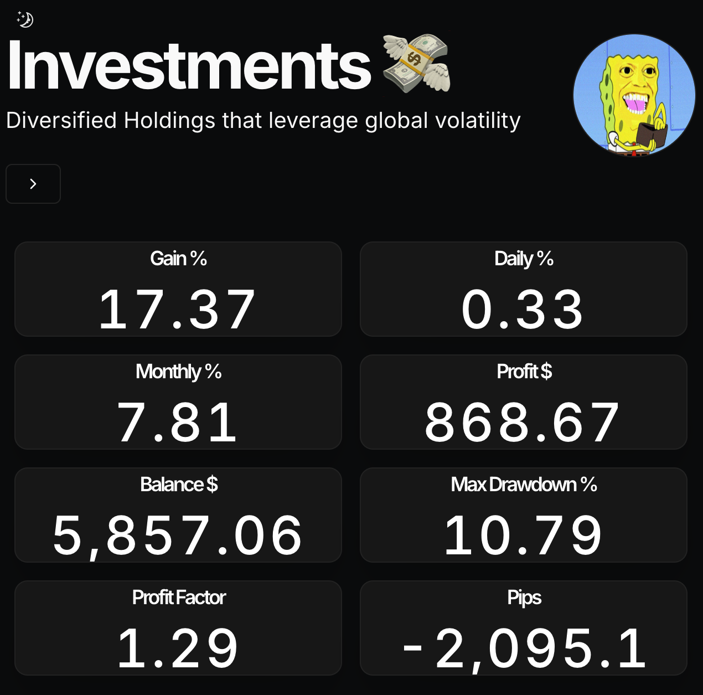
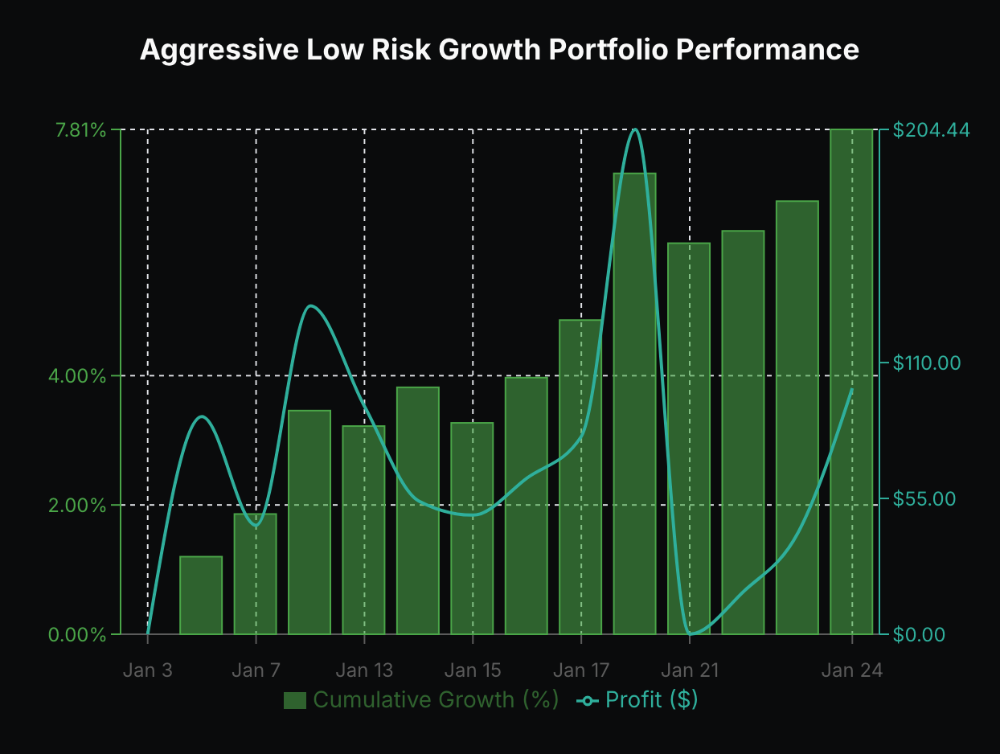
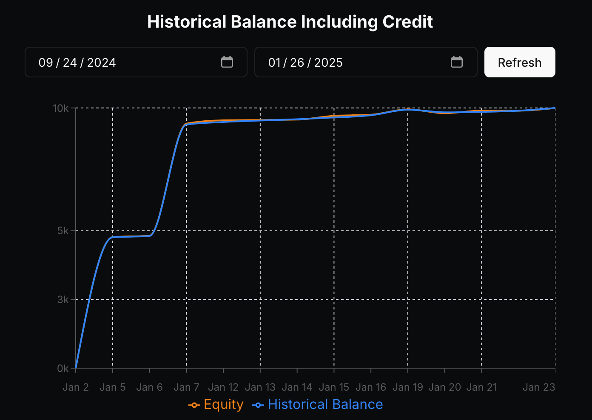
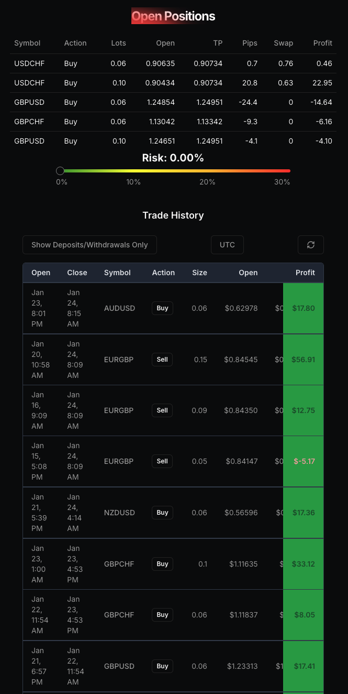

# Investment portfolio

# Features

- Setup only takes a few minutes by editing the [single config file](./src/data/resume.tsx)
- Built using Next.js 14, React, Typescript, Shadcn/UI, TailwindCSS, Framer Motion, Magic UI
- Responsive for different devices
- Optimized for Next.js and Vercel






# Getting Started Locally

1. Clone this repository to your local machine:

   ```bash
   git clone <URL>
   ```

2. Move to the cloned directory

   ```bash
   cd portfolio
   ```

3. Install dependencies:

   ```bash
   pnpm install
   ```

4. Start the local Server:

   ```bash
   pnpm dev
   ```

5. Open the [Config file](./src/data/resume.tsx) and make changes

6. Populate the .env.example with your myfxbook API parameters

7. `vc deploy --prod`

# Extra

There's some unused components for embedding Coingecko charts without an API key and a Tradingview interactive chart, feel free to use them in your project!

# Inspiration

[Dillion Verma Portfolio](https://github.com/dillionverma/portfolio)

# License

Licensed under the [MIT license](https://github.com/dillionverma/portfolio/blob/main/LICENSE.md).
